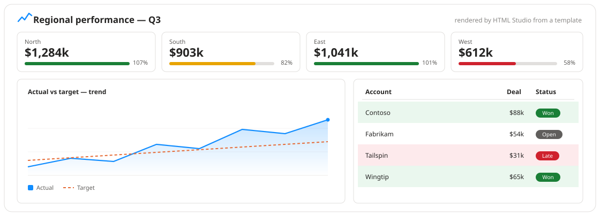

<div align="center">

# HTML Studio

### Design your Power BI report content in HTML — and stop building it with DAX.

[](https://github.com/selimozbas/PowerBI-HTML-Studio/actions/workflows/build.yml)
[](https://github.com/selimozbas/PowerBI-HTML-Studio/releases)
[](LICENSE)



</div>

HTML Studio is a Power BI custom visual that turns your data into **HTML and SVG**
on the report canvas. It's the "just show my HTML" idea from the classic
*HTML Viewer* / *HTML Content* visuals — but with a **templating engine**, a
**component library**, **interactive charts**, **Bootstrap 5**, and a
**Monaco editor built into the visual**. You bind a few fields, write a small
template, and get cards, tables, scorecards, timelines and charts — themed,
cross-filtering and export-ready.

---

## Why HTML Studio

The old HTML visuals give you one text box: whatever string your column or
measure produces gets rendered. In practice that means building HTML **inside
DAX** — nested `"<div style=""" & ...` that nobody wants to maintain.

HTML Studio flips it around. Your fields stay as fields. You write the markup
**once**, as a template, and the visual fills it in per row:

```handlebars
{{#each rows}}
  <div class="card mb-2"><div class="card-body">
    <div class="d-flex justify-content-between">
      <b>{{content}}</b>
      {{> deltaBadge value=Actual base=Target}}
    </div>
    {{{bar(Actual, Target)}}}
    <small class="text-secondary">{{percent(pctOfTotal(Actual, rows, "Actual"), 1)}} of total</small>
  </div></div>
{{/each}}
```

No string concatenation, no `FORMAT()` gymnastics, no CDN.

---

## Highlights

### 📝 A real templating language

`{{Field}}` interpolation, `{{#if a > b}}` / `{{#each rows}}` / `{{#unless}}`
blocks, and **46 helpers** — `format`, `number`, `percent`, `currency`, `date`
(locale-aware), plus `sum` / `avg` / `top` / `where` / `sortBy` / `rank` /
`pctOfTotal` / `groupBy` so you can build **subtotals, top-N lists,
leaderboards and grouped sections without DAX**. It's an AST interpreter — no
`eval`, no dynamic code — so it's sandbox- and certification-safe.
→ [Templating](docs/templating.md) · [Helpers](docs/helpers.md)

### 🧩 A component library

`{{> kpi label=Region value=Actual target=Target}}` — 14 ready components
(`kpi`, `trend`, `gauge`, `sparkRow`, `pill`, `ratingStars`, `timelineItem`,
`comparison`, `calloutCard`, …). Compose them, or define your own with
`@partial name`.
→ [Components](docs/components.md)

### 📊 Real interactive charts, inside your HTML

```html
<div data-hf-chart='{"type":"area","x":"Month","y":["Actual","Target"]}'></div>
```

A [uPlot](https://github.com/leeoniya/uPlot) canvas chart — line / spline /
area / bar — driven by your bound rows, resized with the visual, and rendered
faithfully in **Export to PDF / PowerPoint**. Plus `{{qr(url)}}` for inline QR
codes.
→ [Charts](docs/charts.md)

### 🎛️ It's also a slicer. And a checklist.

- `data-hf-select="Region:North"` — click to **cross-highlight** the report.
- `data-hf-filter="Region:North"` — click to **filter** every other visual
  (build your own HTML nav / button bar / tree slicer).
- `data-hf-state="signoff.legal"` on a checkbox — the tick is **remembered
  with the report** (a shared checklist / sign-off panel).

→ [Interactivity](docs/interactivity.md)

### 🎨 Themes, presets, fonts — and Bootstrap 5

- The active **report theme** is exposed as CSS variables
  (`--hf-accent`, `--hf-foreground`, …); SVG helpers and components use them,
  so everything matches.
- One-click **style presets**: Cards · Minimal · Dark · Newspaper · Accent tiles.
- **Google Fonts** (`@import`) or self-hosted `@font-face`, plus **RTL** and
  locale-aware number / date formatting.
- **Bootstrap 5** CSS **and** ~2,000 **Bootstrap Icons** are bundled (webfont
  inlined — no CDN). `data-bs-toggle="collapse"`, `data-bs-toggle="tab"`,
  carousels, tooltips, toasts all work.

→ [Styling](docs/styling.md)

### 🧑‍💻 A real editor, built in

In report edit mode, the **✎ Template** button opens a **Monaco** editor
(the VS Code engine) right inside the visual:

- `{{ }}` / HTML syntax highlighting
- autocomplete for **your field names**, every **helper** and every **component**
- a **starter-template gallery** (KPI cards, chart card, component dashboard, …)
- a **live preview** built from a sample of your rows, and a **Data** tab
- inline **lint markers** for unbalanced blocks and unknown helpers

### 🔒 Safe and self-contained

Author HTML goes through **DOMPurify** before it touches the DOM (policy
presets: Standard / Strict / Trusted / Custom). Bootstrap, its icon font,
uPlot, the QR generator and Monaco are **all bundled** — nothing is fetched at
runtime, so the visual works **offline** and in **export**.
→ [Security & limitations](docs/security-and-limitations.md)

### 🌍 Localised & export-ready

UI in **English and Turkish**, RTL support, and an **Optimize for export /
print** mode that expands virtualized rows and drops chrome for a clean PDF.
Large results are **windowed** automatically past 250 rows.

---

## HTML Studio vs. the classic HTML visuals

| | Classic *HTML Content / Viewer* | **HTML Studio** |
| --- | :---: | :---: |
| Render column / measure as HTML & SVG | ✅ | ✅ |
| `http(s)` links, cross-filter, context menu | ✅ | ✅ |
| **Templating** (`{{#each}}`, `{{#if}}`, helpers) | — | ✅ |
| **Named data fields** (`{{Revenue}}`) | — | ✅ up to 20 |
| **Component library** & user partials | — | ✅ |
| **Interactive charts** in-content | — | ✅ (uPlot) |
| **HTML slicer** mode (`applyJsonFilter`) | — | ✅ |
| **Viewer write-back** (checklists) | — | ✅ |
| **Bootstrap 5 + icon font** bundled | — | ✅ |
| **Monaco editor** in the visual | — | ✅ |
| Conditional formatting rules / colour scales | — | ✅ |
| Style presets · Google Fonts · RTL · l10n | — | ✅ |
| Works offline / in export (no CDN) | partial | ✅ |

---

## Quick start

1. **Install** — download the latest `.pbiviz` from
   [Releases](https://github.com/selimozbas/PowerBI-HTML-Studio/releases), then
   Power BI Desktop → **Insert → More visuals → Import a visual from a file**.
2. **Bind data** — put a column/measure on **Content**; add more measures to
   **Data (named fields)** to reference them as `{{Name}}`.
3. **Go template** — Format pane → **Content → Content source → Template**, then
   click **✎ Template** on the visual (in edit mode) and start from a gallery
   sample.

Full walkthrough: [docs/getting-started.md](docs/getting-started.md).

## Documentation

[**`docs/`**](docs/README.md) — getting started · templating · helpers ·
components · `data-*` attributes · charts · conditional formatting ·
interactivity · styling · settings reference · security & limitations ·
development.

## Build from source

```bash
npm install        # also generates the vendored Bootstrap CSS (prepare)
npm start          # pbiviz start — live in Power BI Desktop / Service
npm test           # vitest
npm run package    # dist/*.pbiviz
```

See [docs/development.md](docs/development.md) for the project layout, the
two-`tsconfig` setup, and the release flow.

## Contributing & security

[CONTRIBUTING.md](CONTRIBUTING.md) · [SECURITY.md](SECURITY.md) (report
vulnerabilities privately) · [PRIVACY.md](PRIVACY.md).

## License

[MIT](LICENSE) · Not affiliated with or endorsed by Microsoft.
